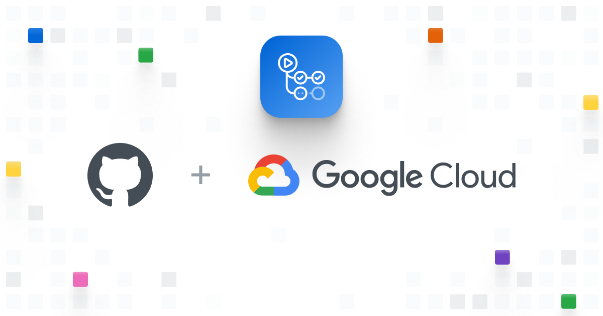
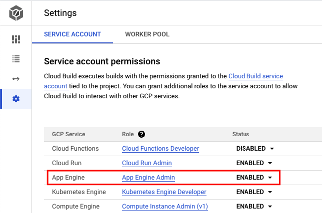

<div align="center" id="top"> 
  

&#xa0;

</div>

<h1 align="center">Google App Engine with GitHub Actions</h1>

<p align="center">
  
  
  
  
  
</p>

<p align="center">
  <a href="#dart-about">About</a> &#xa0; | &#xa0; 
  <a href="#rocket-technologies">Technologies</a> &#xa0; | &#xa0;
  <a href="#white_check_mark-requirements">Requirements</a> &#xa0; | &#xa0;
  <a href="#checkered_flag-starting">Starting</a> &#xa0; | &#xa0;
  <a href="#memo-license">License</a> &#xa0; | &#xa0;
  <a href="https://github.com/devenes" target="_blank">Author</a>
</p>

<br>

## :dart: About

Simple example of how to deploy a web application to Google App Engine using GitHub Actions.

## :rocket: Technologies

The following tools were used in this project:

- [GitHub Actions](github.com)
- [Google Cloud SDK](https://cloud.google.com/sdk)
- [Google App Engine](https://cloud.google.com/appengine)

## :white_check_mark: Requirements

Before starting :checkered_flag:, you need to have [Git](https://git-scm.com) and [Google Cloud SDK](https://cloud.google.com/sdk) installed. Also, you need to have a Google Cloud account. You can create one [here](https://cloud.google.com/). And finally, you need to have a Google project to deploy Google App Engine. You can create one [here](https://console.cloud.google.com/appengine).

## Authorization for App Engine

To deploy your app to App Engine you need to build your app and then deploy it. To build your app you need to authorize Cloud Build to access your App Engine resources. To do this, you need to enable it and grant Cloud Build the necessary permissions to access your resources.



## :checkered_flag: Starting

```bash
# Clone this project
git clone https://github.com/devenes/google-app-engine-action

# Access
cd google-app-engine-action

# Create the app
gcloud app create

# Deploy the app
gcloud app deploy

# After the deployment you will see the URL of your app
```

## :memo: License

This project is under license from MIT. For more details, see the [LICENSE](LICENSE) file.

Made with :heart: by <a href="https://github.com/devenes" target="_blank">devenes</a>

&#xa0;

<a href="#top">Back to top</a>
